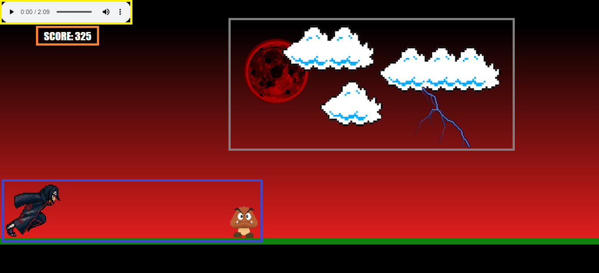
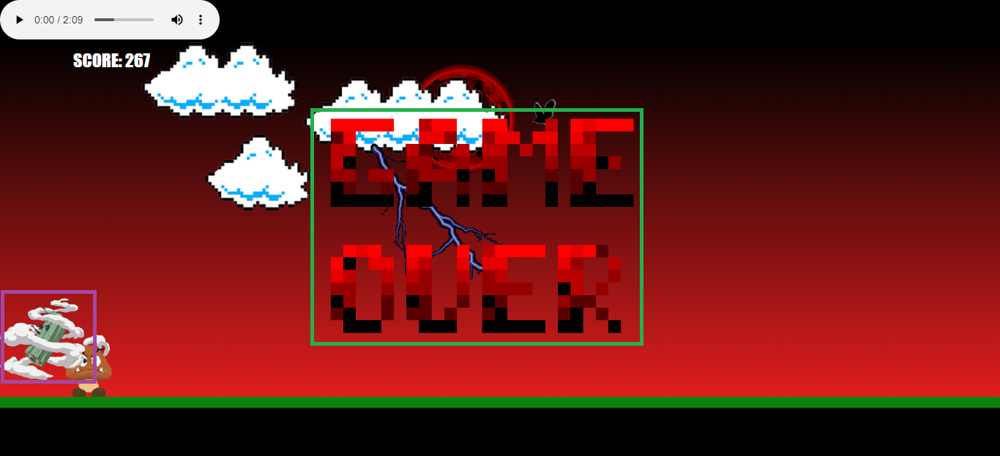

# **ITACHI X GOOMBA RUN - JS GAME** <h1>

 

Este jogo simples tem como objetivo o estudo de implementação de **HTML**, **CSS** e **JavaScript** nível básico.

 

Foram inseridos no jogo:

Quadro Amarelo => Display de aúdio com música tema do personagem;

Quadro Laranja => Sistema de Score/Pontuação;

Quadro Cinza => Sprites de corvo e nuvens com animação;

Quadro Azul => Sprites de personagens com animação;

 

Quadro Rosa => Interação entre os personagens;

Quadro Verde => Aviso de Game Over.
